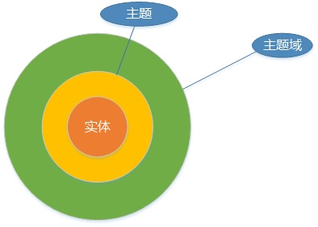

# 主题划分

## 主题

​	主题是与传统数据库的面向应用相对应的，是一个抽象概念。是在较高层次上将企业信息系统中的数据综合、归类并进行分析利用的抽象。

​	**每一个主题对应一个宏观的分析领域。**在逻辑意义上，它是对应企业中某一宏观分析领域所涉及的分析对象。面向主题的数据组织方式，就是在较高层次上对分析对象数据的一个完整并且一致的描述，能刻画各个分析对象所设计的企业各项数据，以及数据之间的联系。

​	所谓较高层次是相对面向应用的数据组织方式而言的，是指按照主题进行数据组织的方式具有更高的数据抽象级别。与传统数据库面向应用进行数据组织的特点而言，数据仓库中的数据是面向主题进行组织的。**主题是根据分析的要求来确定的。**这与按照数据处理或应用的要求来组织数据是不同的。

## 主题域

> 主题域通常是**联系较为紧密**的数据**主题的集合**。可以根据业务的关注点，将这些数据主题划分到不同的主题域。主题域的确定必须由**最终用户**和**数据仓库**的设计人员共同完成。

### 关于主题域与主题、实体的关系

​	主题设计是对主题域进一步分解，细化的过程。主题域下面可以有多个主题，主题还可以划分成更多的子主题，而实体则是不可划分的最小单位。主题域、主题、实体的关系如下图所示：

