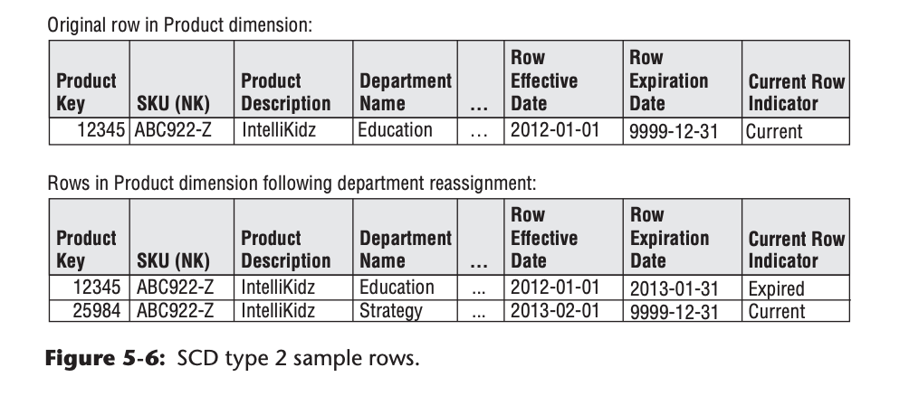
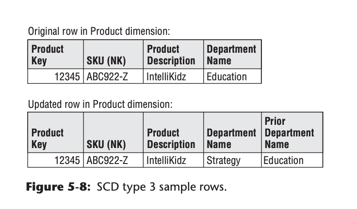
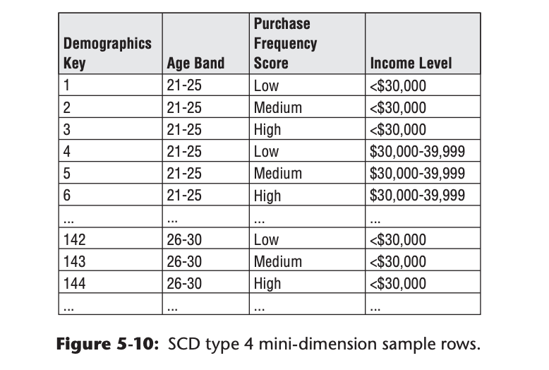
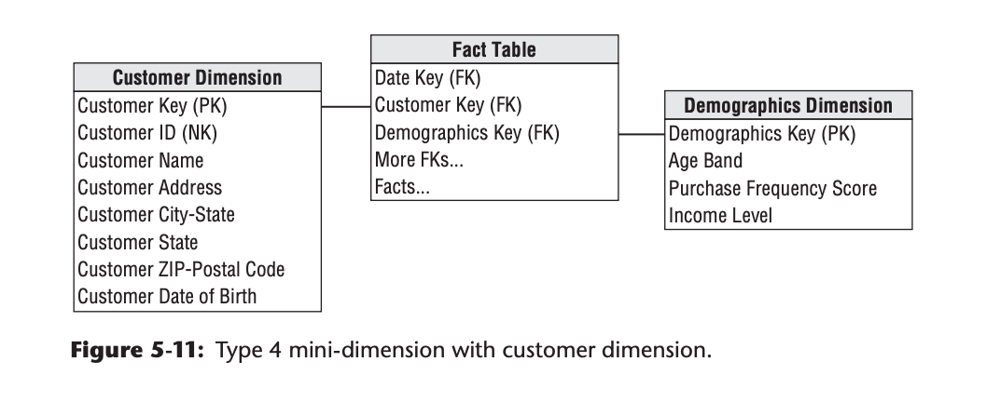

# 概念（Slowly Changing Dimensions）：

> 维度表里面的数据并非是始终不变的，会随着时间发生变化。

## 事例：

> 在员工维度表中，某员工原来在北京分公司工作，后来调往上海分公司，那么“工作地点”就是一个缓慢变化维度。

## 问题：

> 针对这种情况，线上的业务系统会直接将该员工的信息在业务表里面进行update；但是由于在数据仓库中有时需要我们进行历史变化分析，那么为了防止分析数据有误，我们则需要考虑针对维度的历史数据变化而进行处理。

# 方法：

> 处理的方法有如下几种，具体可以参见《The Data Warehouse Toolkit, 3rd Edition》

## SCD Type 0:Retain Original（维持现状）

一种特殊的SCD类型，即不管维度属性的实际值如何变化，数仓中维度的值都会维持第一次的值。它主要适用于那些本身含义就是“原始值”（original）的维度。例如作为客户的原始信用评分或持久标识。 这也适用于大多数日期维度中的属性。

## SCD Type 1:Overwrite（覆盖）

最简单的SCD类型，即一旦维度属性的实际值发生变化，就会直接覆写到数仓中。数仓中的维度属性总是且仅仅保存着最近一次变更的值。

对于type 1，维度行中的旧属性值将被新的覆盖值；type 1属性始终反映最新的工作，因此该技术破坏了历史情况。 尽管该方法易于实施且不需要建立额外的维度行，但使用时需小心，因为受此影响的聚集实时表和OLAP多维数据库将会重复计算。

## SCD Type 2: Add New Row（添加新行）

对于type 2，将在维度表中增加新行，新行中采用修改的属性值。要实现该方法，需要维度主键更具有一般性，不能仅采用自然键或持久键，因此采用该方法时经常出现多行描述同样成员的情况。在为维度成员建立新行时，将为其分配新的主代理键，在修改发生后，将其作为所有事实表的外键，知道后续发生产生新维度键并更新维度行。

当变化type 2发生时，最少需要在维度行中增加3个额外列：

1.行有效的日期/时间戳列

2.行截止日期/时间戳列

3.当前行标示

## SCD Type 3: Add New Attribute（添加新属性列）

Type 2虽然非常好，但是当要在同一个时间维度内把新值和旧值关联起来时，就没有那么方便了。比如在上一节的表中，如果查询2013年2月1日以后的记录，就只能查到Department Name为“Strategy”的记录，而“Education”就被屏蔽了。Type 3就是一种与Type 2互补的类型。在Type 3的处理方法中，不会添加新行，而会添加一个新的属性列，该属性列中保存有对应维度的上一次变化的值。

这种type 3变化有时称为替换现实，商业用户可以利用当前值或替换现实来分组或过滤事实数据。此种缓慢变化维度技术不太常用。

## SCD Type 4: Add Mini-Dimension（添加微维度）

当维度的变化没有那么“缓慢”时，前面三种类型的处理就都显得力不从心了（特别是对于规模非常大的维度表，比如有百万甚至千万行）。这种维度一般就不再称为SCD，而称为“快速变化维度”（rapidly changing dimensions, RCD）。当RCD的规模比较小时，还能够采用Type 2或者Type 3来撑着，但规模很大时，就只能采用Type 4了。

Type 4的方式是将那些快速变化的维度从原来的大维度表中拆分出来单独处理，是为微维度（mini-dimension）。这一方案是采用不同的维度消除频繁分析或频繁变化的属性。例如，可以为一组不稳定的客户人口统计学属性（如：年龄、购买频度积分和收入水平等）建立一个微型维度，认为这些属性中的这些列被用于扩展和变化对业务是非常重要的。对每个唯一的年龄、购买频度积分和收入水平的组合，在微型维度中采用一行表示，而不是每个客户一行的方式。利用该方法，微型维度变成人口统计学概要的集合。尽管客户维度包含几百万行，微型维度中的行将显著减少。仅仅从原始的几百万行客户表中留下更稳定的属性。

