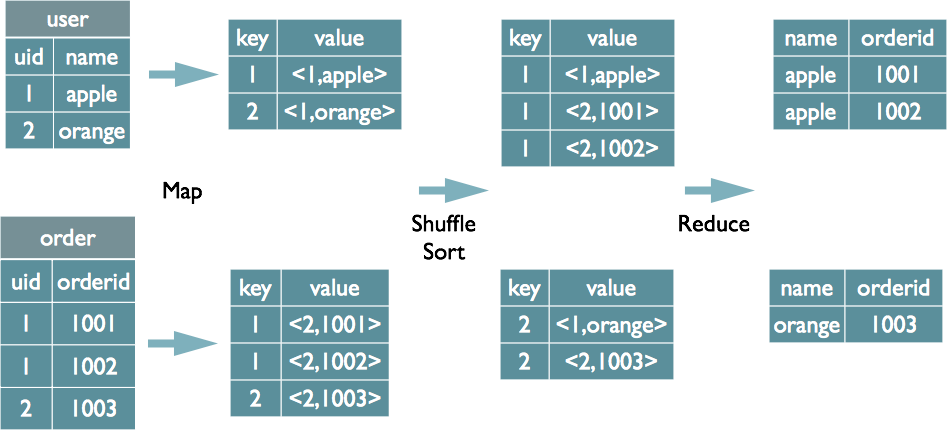
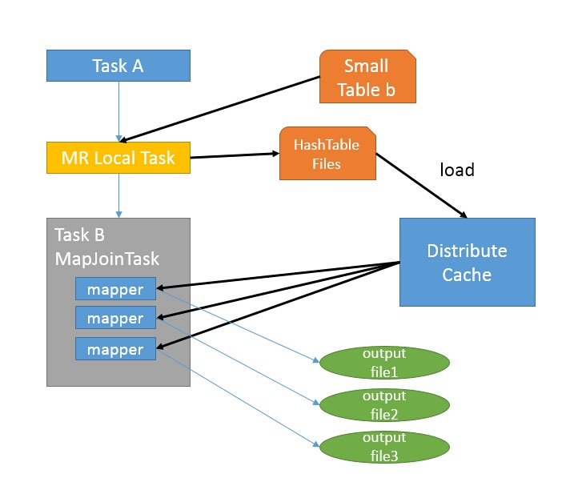

> hive执行引擎会将HQL“翻译”成为map-reduce任务，如果多张表使用同一列做join则将被翻译成一个reduce，否则将被翻译成多个map-reduce任务。

```sql
--将被翻译成1个map-reduce任务
SELECT
    a.val, b.val, c.val
FROM a
JOIN b
    ON a.key = b.key1
JOIN c
    ON c.key = b.key1


--将被翻译成多个map-reduce任务
SELECT
    a.val, b.val, c.val
FROM a
JOIN b
    ON a.key = b.key1
JOIN c
    ON c.key = b.key2
```

​	map过程负责分发数据，具体的join操作在reduce完成。因此，如果多表基于不同的列做join，则无法在一轮map-reduce任务中将所有相关数据shuffle到统一个reducer。
​	对于多表join，hive会将前面的表缓存在reducer的内存中，然后后面的表会流式的进入reducer和reducer内存中与其它的表做join。
​	为了防止数据量过大导致oom，将数据量最大的表放到最后；或者通过“STREAMTABLE”显示指定reducer流式读入的表。


> Hive中的Join可分为Common Join（Reduce阶段完成join）和Map Join（Map阶段完成join）

#### Common Join

```sql
select u.name, o.orderid from order o join user u on o.uid = u.uid;
```

**1.Map阶段**
读取源表的数据，Map输出时候以Join on条件中的列为key，如果Join有多个关联键，则以这些关联键的组合作为key；Map输出的value为join之后所关心的(select或者where中需要用到的)列；同时在value中还会包含表的Tag信息，用于标明此value对应哪个表；按照key进行排序。

**2.Shuffle阶段**
根据key的值进行hash,并将key/value按照hash值推送至不同的reduce中，这样确保两个表中相同的key位于同一个reduce中

**3.Reduce阶段**
根据key的值完成join操作，期间通过Tag来识别不同表中的数据。



#### Map Join

MapJoin通常用于一个很小的表和一个大表进行join的场景，具体小表有多小，由参数hive.mapjoin.smalltable.filesize来决定，该参数表示小表的总大小，默认值为25000000字节，即25M。


假设a表为一张大表，b为小表，并且hive.auto.convert.join=true,那么Hive在执行时候会自动转化为MapJoin。



1.如图中的流程，首先是Task A，它是一个Local Task（在客户端本地执行的Task），负责扫描小表b的数据，将其转换成一个HashTable的数据结构，并写入本地的文件中，之后将该文件加载到DistributeCache中，该HashTable的数据结构可以抽象为：

| key  | Value |
| ---- | ----- |
| 1    | 26    |
| 2    | 34    |

2.接下来是Task B，该任务是一个没有Reduce的MR，启动MapTasks扫描大表a,在Map阶段，根据a的每一条记录去和DistributeCache中b表对应的HashTable关联，并直接输出结果。
由于MapJoin没有Reduce，所以由Map直接输出结果文件，有多少个Map Task，就有多少个结果文件。


总的来说，因为小表的存在，可以在Map阶段直接完成Join的操作，为了优化小表的查找速度，将其转化为HashTable的结构，并加载进分布式缓存中。