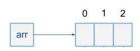
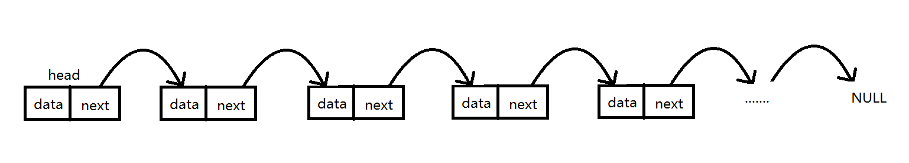

# 栈简介：

> ***栈是一种运算受限的线性表***，其限制是指仅允许在表的一端进行插入和删除操作，这一端被称为栈顶（Top），相对地把另一端称为栈底（Bottom）。
>
> 把新元素放到栈顶的上面，使之成为新的栈顶元素称作进栈、入栈或压栈（Push）；把栈顶元素删除，使其相邻的元素成为新的栈顶元素称作出栈或退栈（Pop）。这种受限的运算使栈拥有“先进后出（First In Last Out）”的特性（FILO）。
>
> 栈分顺序栈和链式栈两种。栈是一种**线性结构**，所以可以使用数组或链表（单向链表、双向链表或循环链表）作为底层数据结构。***使用数组实现的栈叫做顺序栈，使用链表实现的栈叫链式栈***。二者的区别是顺序栈中的元素地址连续，链式栈中的元素地址不连续。

## 数组与链表的区别

### 1.数组

> 数组是由下标索引和data两部分组成

#### 1.1.特点：

1.在内存中，数组是一块连续的区域

2.数组需要预留空间，在使用前需要先申请内存的大小；这样可能会浪费内存空间

> 比如看电影时，为了保证10个人能坐在一起，必须提前订好10个连续的位置。这样的好处就是能保证10个人可以在一起。但是这样的缺点是，如果来的人不够10个，那么剩下的位置就浪费了。如果临时有多来了个人，那么10个就不够用了，这时可能需要将第11个位置上的人挪走，或者是他们11个人重新去找一个11连坐的位置，效率都很低。如果没有找到符合要求的作为，那么就没法坐了。

3.插入数据和删除数据效率低

> 插入数据时，这个位置后面的数据在内存中都要向后移。删除数据时，这个数据后面的数据都要往前移动。 比如原来去了5个人，然后后来又去了一个人要坐在第三个位置上，那么第三个到第五个都要往后移动一个位子，将第三个位置留给新来的人。 当这个人走了的时候，因为他们要连在一起的，所以他后面几个人要往前移动一个位置，把这个空位补上。

4.随机读取效率很高

> 因为数组是连续的，知道每一个数据的内存地址，可以直接找到该地址的数据。

5.不利于扩展，数组定义的空间不够时需要重新定义数组

#### 1.2.优点：

1.随机访问性强

2.查找速度快

#### 1.3缺点：

1.插入和删除效率低

2.可能浪费内存

3.内存空间要求高，必须有足够的连续内存空间

4.数组大小固定，不能动态拓展

### 2.链表

> 链表是有data和指向下一个数据的指针地址两部分组成

#### 2.1.特点：

1.在内存中可以存在任何地方，不要求连续

2.每一个数据都保存了下一个数据的内存地址，通过这个地址找到下一个数据

3.增加数据和删除数据很容易

4.查找数据时效率低，因为不具备随机访问性，所以访问某个位置的数据都要从第一个位置的数据开始访问，然后更具第一个数据保存的下一个数据的地址找到第二个数据

5.不指定大小，拓展方便。链表的大小不用定义，数据随意增删

#### 2.2.优点：

1.插入删除速度快

2.内存利用率高，不会浪费内存

3.大小没有固定，拓展很灵活

#### 2.3.缺点：

不能随机查找，必须从第一个开始遍历，查找效率低

### 3.总结：

| -    | 数组 | 链表 |
| ---- | ---- | ---- |
| 读取 | O(1) | O(n) |
| 插入 | O(n) | O(1) |
| 删除 | O(n) | O(1) |

#### 重点介绍：

1.Vector、ArrayList都是以数组的形式存储在内存中，所以查询效率高，新增和删除效率不高。但是Vector呗Synchronized修饰，所以线程是安全的，ArrayList线程不安全。

2.LinkedList则以链表的形式进行存储，所以查询效率低，新增和删除效率高，并且线程不安全。

# 堆简介：

https://blog.csdn.net/ZHUO_SIR/article/details/80998631

