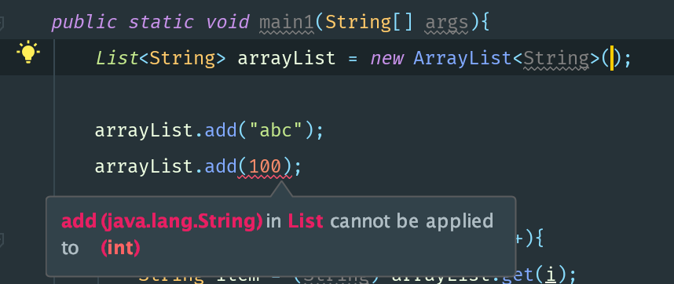

> 参考：https://blog.csdn.net/s10461/article/details/53941091

# 1.概念

泛型，即“参数化类型”。一提到参数，最熟悉的就是定义方法时有形参，然后调用此方法时传递实参。那么参数化类型怎么理解呢？顾名思义，就是***将类型由原来的具体的类型参数化***，类似于方法中的变量参数，此时类型也定义成参数形式（可以称之为类型形参），***然后在使用/调用时传入具体的类型***（类型实参）。

> 即此时不仅参数是不定的，甚至参数的类型也是不定的。


泛型的本质是为了参数化类型（在不创建新的类型的情况下，通过泛型指定的不同类型来控制形参具体限制的类型）。也就是说在泛型使用过程中，操作的数据类型被指定为一个参数，这种参数类型可以用在类、接口和方法中，分别被称为泛型类、泛型接口、泛型方法。


# 2.例子

```java
List arrayList = new ArrayList();
arrayList.add("aaaa");
arrayList.add(100);

for(int i = 0; i< arrayList.size();i++){
    String item = (String)arrayList.get(i);
    Log.d("泛型测试","item = " + item);
}
```

毫无疑问，程序的运行结果会以崩溃结束：

```java
java.lang.Integer cannot be cast to java.lang.String
```

`ArrayList`可以存放任意类型，例子中添加了一个`String`类型，添加了一个`Integer`类型，再使用时都以`String`的方式使用，因此程序崩溃了。为了解决类似这样的问题（在编译阶段就可以解决），泛型应运而生。


我们将第一行声明初始化list的代码更改一下，编译器会在编译阶段就能够帮我们发现类似这样的问题。

```java
List<String> arrayList = new ArrayList<String>();

//在编译阶段，编译器就会报错
//arrayList.add(100); 
```




# 3.特性

```java
        List<String> stringList = new ArrayList<String>();
        List<Integer> integerList = new ArrayList<Integer>();

        Class classStringList = stringList.getClass();
        Class classIntegerList = integerList.getClass();

        if(classStringList.equals(classIntegerList)){
            System.out.println("classStringList 类型:" + classStringList);
            System.out.println("classIntegerList 类型:" + classIntegerList);

            System.out.println("泛型测试：类型相同");

        }
```

```java
classStringList 类型:class java.util.ArrayList
classIntegerList 类型:class java.util.ArrayList
泛型测试：类型相同
```

通过上面的例子可以证明，在编译之后程序会采取去泛型化的措施。也就是说Java中的泛型，只在编译阶段有效。在编译过程中，正确检验泛型结果后，会将泛型的相关信息擦除，并且在对象进入和离开方法的边界处添加类型检查和类型转换的方法。也就是说，***泛型信息不会进入到运行时阶段***。


> **对此总结成一句话：泛型类型在逻辑上看以看成是多个不同的类型，实际上都是相同的基本类型。**


# 4.使用

> 泛型有三种使用方式，分别为：泛型类、泛型接口、泛型方法

## 4.1泛型类

泛型类型用于类的定义中，被称为泛型类。通过泛型可以完成对一组类的操作对外开放相同的接口。最典型的就是各种容器类，如：`List`、`Set`、`Map`。

泛型类的最基本写法：

```java
class 类名称 <泛型标示：可以随便写任意标识符号，标示制定的泛型的类型>{
  private 泛型标识/*成员变量类型*/ var;
  …
}
```


一个最普通的泛型类：

```java
/**
 * @author lihanwen
 * @param <T> 泛型类
 * 此处T可以随便写为任意标识，常见的如T、E、K、V等形式的参数常用于表示泛型
 * 在实例化泛型类时，必须指定T的具体类型
 */
public class Generic<T> {
    /**
     * key这个成员变量的类型为T，T的类型由外部指定
     */
    private T key;

    /**
     * 泛型构造方法形参key的类型也为T，T的类型由外部指定
     * @param key 参数
     */
    public Generic(T key){
        this.key = key;
    }

    /**
     * 泛型方法getKey的返回值类型为T，T的类型由外部指定
     * @return key
     */
    public T getKey(){
        return key;
    }

}
```

> 泛型的类型参数只能是类类型（包括自定义类），不能是简单类型

```java
/**
 * @author lihanwen
 */
public class GenericMain {
    public static void main(String[] args){
        //传入的实参类型需与泛型的类型参数类型相同，即为Integer.
        Generic<Integer> integerGeneric = new Generic<>(1234);

        //传入的实参类型需与泛型的类型参数类型相同，即为String.
        Generic<String> stringGeneric = new Generic<>("abc");

        System.out.println(integerGeneric.getKey());
        System.out.println(stringGeneric.getKey());

    }
}

//结果：
//1234
//abc
```


定义的泛型类，就一定要传入泛型类型实参么？并不是这样，在使用泛型的时候如果传入泛型实参，则会根据传入的实参做相应的限制，此时的泛型才会起到本应起到的限制作用。***如果不传入泛型类型实参的话，在泛型类中使用泛型的方法或成员变量定义的类型可以为任何类型***。

```java
    public static void main(String[] args){
        Generic generic0 = new Generic("abc");
        Generic generic1 = new Generic(123);
        Generic generic2 = new Generic(55.64);
        Generic generic3 = new Generic(false);

        System.out.println(generic0.getKey());
        System.out.println(generic1.getKey());
        System.out.println(generic2.getKey());
        System.out.println(generic3.getKey());

    }
```


## 4.2泛型接口

泛型接口与泛型类的定义及使用基本相同。泛型接口常被用在各种类的生产器中，具体如下：

```java
/**
 * 定义一个接口泛型
 * @param <T>
 */
public interface Generator<T> {

    public T next();

}
```

```java
/**
 * 传入泛型实参时：
 * 定义一个生产器实现这个接口，虽然我们只创建了一个泛型接口Generator<T>
 * 但是我们可以为T传入无数个实参，形成无数种类型的Generator接口
 * 在实现类实现泛型接口时，如已将泛型类型传入实参类型，则所有使用泛型的地方都要替换成传入的实参类型
 * @author lihanwen
 */
public class FruitGenrtator implements Generator<String> {

    private String[] fruits = new String[]{"Apple","Banana","Pear"};

    @Override
    public String next() {
        Random random = new Random();
        return fruits[random.nextInt(3)];
    }
}
```

```java
/**
 * @author lihanwen
 */
public class FruitGeneratorMain {
    public static void main(String[] args){
        System.out.println(new FruitGenrtator().next());
    }
}
```


## 4.3泛型通配符

我们知道`Integer`是`Number`的一个子类，同时在上述特性中我们也验证了`Generic<Integer>`和`Generic<Number>`实际上是相同的一种基本类型。那么问题来了，在使用`Generic<Number>`作为形参的方法中，能否使用`Generic<Integer>`的实例传入呢？在逻辑上类似于`Generic<Number>`和`Generic<Integer>`是否可以看成具有父子关系的泛型类型呢？


为了弄清楚这个问题，我们使用`Generic<T>`这个泛型类继续看下面的例子

```java
    public void showKeyValue(Generic<Number> obj){
        
        Log.debug("泛型测试：" +obj.getKey());
    }
```

```java
    public static void main(String[] args){
        Generic<Integer> integerGeneric = new Generic<>(123);
        Generic<Number> numberGeneric = new Generic<>(456);

        showKeyValue(numberGeneric);
        //showKeyValue(integerGeneric);
        //使用该方法编译器会报错

    }
```


通过提示信息我们可以看到`Generic<Integer>`不能被看作为`Generic<Number>`的子类。由此可以看出：***同一种泛型可以对应多个版本（因为参数类型是不确定的），不同版本的泛型类实例是不兼容的。***


回到上面的例子，如何解决上面的问题？总不能为了定义一个新的方法来处理`Generic<Integer>`类型的类，这显然与`Java`中的多台理念相违背。因此我们需要一个在逻辑可以表示同时是`Generic<Number>`和`Generic<Integer>`父类的引用类型。由此类型通配符应用而生。

```java
    public static void showKeyValue(Generic<?> obj){
        System.out.println("泛型测试：" +obj.getKey());
    }
```


类型通配符一般是使用`?`代替具体的类型实参，注意，此处`?`是类型实参，而不是类型形参。直白一点的意思就是，此处的`?`和`Number`、`String`、`Integer`一样都是一种实际的类型。可以把`?`看成所有类型的父类，是一种真实的类型。

可以解决当具体类型不确定的时候，这个通配符就是`?`；当操作类型时，不需要使用类型的具体功能时，只使用`Object`类中的功能。那么可以用`?`通配符来表未知类型。


## 4.4泛型方法

在`Java`中，泛型类的定义非常简单，但是泛型方法就比较复杂了。尤其是我们见到的大多数泛型类中的成员方法也都是用了泛型，有的甚至泛型类中也包含着泛型方法。


> 泛型类，是在实例化类的时候指明泛型的具体类型；泛型方法，是在调用方法的时候指明泛型的具体类型。


### 4.4.1泛型方法的基本用法

```java
public class GenericTest {

    /**
     * 此为泛型类
     * @param <T>
     */
    public class Generic<T>{
        private T key;

        public Generic(T key) {
            this.key = key;
        }

        /**
         * 该方法虽然使用了泛型，但是并不是一个泛型方法
         * 只是类中一个普通的成员方法，只不过他的返回值是在声明泛型类已经声明过的泛型
         * 所以在这个方法中才可以继续使用 T 这个泛型
         * @return key
         */
        public T getKey() {
            return key;
        }
    }

    /**
     * 这才是一个真正的泛型方法
     * 首先在public与返回值之间的 <T> 必不可少，这表明这是一个泛型方法，而且声明了一个泛型 T
     * 这个 T 可以出现在这个泛型方法的任意位置
     * 泛型的数量也可以为多个：
     * public <T,K> K showKeyName(Generic<T> Container){…}
     * @param generic
     * @param <T>
     * @return
     */
    public <T> T showKeyName(Generic<T> generic){
        System.out.println(generic.getKey());
        T test = generic.getKey();

        return test;
    }

    /**
     * 这并不是一个泛型方法，仅是一个普通方法，只是使用了Generic<Number>这个泛型类做形参而已
     * @param obj
     */
    public void showKeyName1(Generic<Number> obj){
        System.out.println(obj.getKey());
    }

    /**
     * 这也不是一个泛型方法，只是一个普通方法，只不过是使用了泛系通配符
     * @param obj
     */
    public void showKeyName2(Generic<?> obj){
        System.out.println(obj.getKey());
    }

    /**
     * 这个方法是有问题的，编译器会提示"Cannot resolve symbol 'E'"
     * 虽然我们声明了<T>，也表明了这是一个可以处理泛型的类型的泛型方法
     * 但是只声明了泛型类型 T ，并未声明泛型类型 E ，因此编译器并不知道该如何处理 E 这个类型
     */
//    public <T> T showkeyName3(Generic<E> eGeneric){
//        …
//    }
    
    public static void main(String[] args){
        
    }


}
```


### 4.4.2类中的泛型方法

当然这并不是泛型方法的全部，泛型方法可以出现在任何地方和任何场景中使用。但是有一种情况是非常特殊的，当泛型方法出现在泛型类中时

```java
package normal.study.fanxing;

public class GenericTestSecond {
    static class Fruit{
        @Override
        public String toString() {
            return "fruit";
        }
    }

    static class Apple extends Fruit{
        @Override
        public String toString() {
            return "Apple";
        }
    }

    static class Person{
        @Override
        public String toString() {
            return "Person";
        }
    }

    /**
     * 此为泛型类
     * @param <T>
     */
    static class GenerateTestFruit<T>{
        public void show1(T t){
            System.out.println(t.toString());
        }

        /**
         * 在泛型类中声明一个泛型方法，使用泛型 E ，这种泛型 E 可以为任意类型，可以与类型 T 相同，也可以不同
         * 由于泛型方法在声明的时候会声明泛型<E>，因此即使在泛型类中并未声明泛型，编译器也能够正确识别泛型方法中识别的泛型
         * @param e
         * @param <E>
         */
        public <E> void show2(E e){
            System.out.println(e.toString());
        }

        /**
         * 在泛型类中声明一个泛型方法，使用泛型 T ，注意此时的 T 是一种全新的类型，可以与泛型类中声明的 T 不是同一种类型
         * @param t
         * @param <T>
         */
        public <T> void show3(T t){
            System.out.println(t.toString());
        }
    }


    public static void main(String[] args){
        Apple apple = new Apple();
        Person person = new Person();
        System.out.println(apple.toString());
        System.out.println(person.toString());

        GenerateTestFruit<Fruit> fruitGenerateTestFruit = new GenerateTestFruit<>();
        //apple是Fruit的子类，所以这里可以访问
        fruitGenerateTestFruit.show1(apple);
        //此处编译器会报错，因为泛型类型实参指定的是Fruit，而传入的实参类是Person
        //fruitGenerateTestFruit.show1(person);

        //使用这两个办法都可以
        fruitGenerateTestFruit.show2(apple);
        fruitGenerateTestFruit.show2(person);

        //使用这两个办法也都可以
        fruitGenerateTestFruit.show3(apple);
        fruitGenerateTestFruit.show3(person);

    }

}

```


### 4.4.3泛型方法与可变参数

```java
    public static void main(String[] args){
        printMsg("111",222,"aaa",55.67);
    }

    public static  <T> void printMsg(T... args){
        for(T t : args){
            System.out.println(t);
        }
    }
```


#### 4.4.4静态方法与泛型

静态方法有一种情况需要注意一下，那就是在类中的静态方法使用泛型：静态方法无法访问类上定义的泛型；如果静态方法操作的引用数据类型不确定的时候，必须要将泛型定义在方法上。

即：***如果静态方法要使用泛型的话，必须将静态方法也定义成泛型方法***

```java
    public static  <T> void printMsg(T... args){
        for(T t : args){
            System.out.println(t);
        }
    }
```

